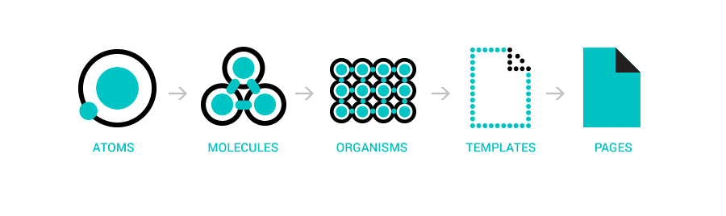

# Forecast App
Clear Cloud            |  Cloudy Cloud              | Rain 
:-------------------------:|:-------------------------: | :-------------------------: 
|  | 


A weather app using Vue3 and a OpenWeatherMap api to processes the data. On top of this, a nodeJS application was 
created to forward the request to the frontend as a solution to CORS and to handle cross-origin requests.

You can find the CORS implementation in this repo: https://github.com/NzrSrd/forward-weather-api 

### Design Concept
Atomic Design is all about choosing a scientific approach to the interface, applying a framework that comes from chemistry.
It introduces a methodology for creating scalable systems, reusable components as well as design systems. 
Since the project is a small one, it was possible to expand to use the three  parts of the concept: 
Atomics, Molecules and Organisms. 


graphic by Brad Frost

A screenshot of the file structure on the atomic design system: 


### Third Party Package
There are only two plugins that was used Axios and Vue Test Utils. 
1. VueAxios: benefits: 
    - Axios performs automatic transforms of JSON data.
    - Axios has wide browser support.
    - Axios uses the data property.
    
2. Vue Test Utils:
    - Is the official unit testing utility for Vue. js
    

 ## To Run the Project
```
git clone < project >
```
## Project setup
```
npm install
```

### Compiles and hot-reloads for development
```
npm run serve
```

### Compiles and minifies for production
```
npm run build
```

### Lints and fixes files
```
npm run lint
```

### Customize configuration
See [Configuration Reference](https://cli.vuejs.org/config/).
